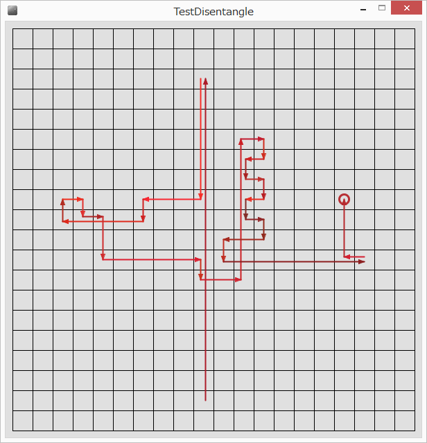

## Drawing Disentangled Line tool

**Drawing disentangled line tool** is a Java based graph positioning tool. Sample test project is based on Processing.

### Canvas environment
A line is a connector between cells. A cell has 2D area and the connecting line can start from and end to any positions in the area.

### What kind of problems this tool solves
Looking for the graph that has smallest cross points.

### Sollution
1. find overlaped lines, the found lines become a set which members are lines.
2. construct superset of all sets found in the previous procedure.
3. count up branches crossing at right angles.
4. move line position to the direction having many crossing lines

### Restriction
Overlaped lines having same directions are drawn on the same position because loop path is supported in this tool. In a loop path lines are drawing many times, therefore if the each positions are changed, many lines are shown and it is not cleared to understand.
